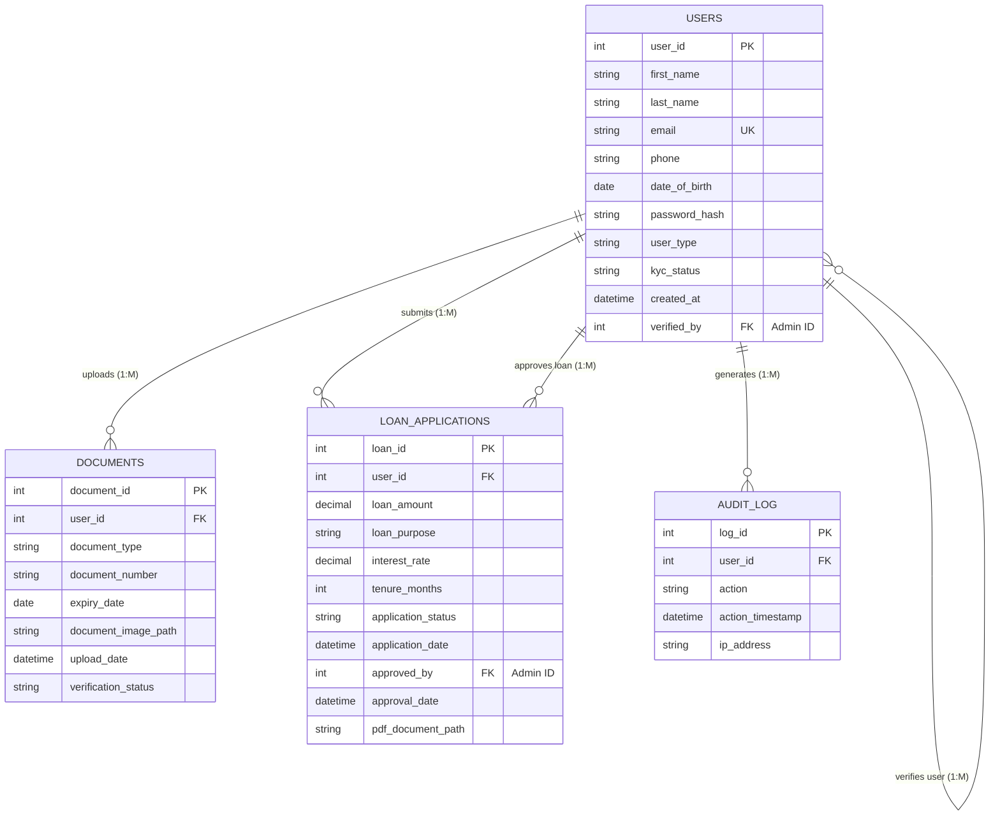

# KYC Loan Management System - Entity Relationship Diagram

## Entities & Schema

### 1. USERS
*Stores all system users (Customers and Admins)*
- **user_id** (PK): Unique identifier
- **first_name**: User's first name
- **last_name**: User's last name
- **email** (Unique): Login email
- **phone**: Contact number
- **date_of_birth**: For age verification
- **password_hash**: AES-256 encrypted password
- **user_type**: 'customer' or 'admin'
- **kyc_status**: 'pending', 'verified', 'rejected'
- **created_at**: Account creation timestamp
- **verified_by** (FK -> USERS.user_id): Admin who verified this user (nullable)

### 2. DOCUMENTS
*KYC documents uploaded by customers*
- **document_id** (PK): Unique identifier
- **user_id** (FK -> USERS.user_id): Owner of the document
- **document_type**: 'CNIC', 'Passport', 'Driving License'
- **document_number**: ID number on the document
- **expiry_date**: Document validity
- **document_image_path**: File storage location
- **upload_date**: When it was uploaded
- **verification_status**: 'pending', 'verified', 'rejected'

### 3. LOAN_APPLICATIONS
*Loan requests made by customers*
- **loan_id** (PK): Unique identifier
- **user_id** (FK -> USERS.user_id): Applicant
- **loan_amount**: Requested amount
- **loan_purpose**: Reason for loan
- **interest_rate**: Applied interest %
- **tenure_months**: Duration of loan
- **application_status**: 'pending', 'approved', 'rejected'
- **application_date**: Date of request
- **approved_by** (FK -> USERS.user_id): Admin who approved (nullable)
- **approval_date**: Date of approval (nullable)
- **pdf_document_path**: Generated agreement/approval letter

### 4. AUDIT_LOG
*Security and activity tracking*
- **log_id** (PK): Unique identifier
- **user_id** (FK -> USERS.user_id): User performing the action
- **action**: 'signup', 'login', 'document_upload', 'kyc_approval', 'loan_request'
- **action_timestamp**: When it happened
- **ip_address**: User's IP

---

## Diagram

## Relationship Explanations

1.  **USERS ↔ DOCUMENTS (1:M)**
    *   One **User** can upload multiple **Documents** (e.g., CNIC and Passport).
    *   `DOCUMENTS.user_id` references `USERS.user_id`.

2.  **USERS ↔ LOAN_APPLICATIONS (1:M)**
    *   One **User** (Customer) can apply for multiple **Loans**.
    *   `LOAN_APPLICATIONS.user_id` references `USERS.user_id`.

3.  **USERS ↔ AUDIT_LOG (1:M)**
    *   One **User** tracks multiple **Audit Log** entries.
    *   `AUDIT_LOG.user_id` references `USERS.user_id`.

4.  **USERS (Admin) ↔ LOAN_APPLICATIONS (1:M)**
    *   One **Admin** (User) can approve multiple **Loans**.
    *   `LOAN_APPLICATIONS.approved_by` references `USERS.user_id`.

5.  **USERS (Admin) ↔ USERS (Customer) (1:M)**
    *   One **Admin** can verify multiple **Customers**.
    *   `USERS.verified_by` references `USERS.user_id`.
